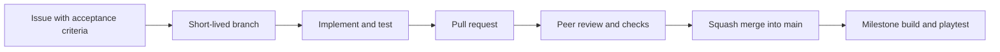

# Keyboard Warrior

A single-player, keyboard-first 2D action demo: fight, parry to earn Smite charges, then complete a typing challenge to cast a Smite.

**Current state:** team collaboration starter. The Unity game has not been created yet. There is no playable build or verified Unity editor/package lock in this repository. The first engineering milestone is to bootstrap and commit the project under `Game/`.

## Start here

| Need | Read |
| --- | --- |
| Understand ownership, milestones, and team routines | [Team plan](docs/team-plan.md) |
| Clone, make a branch, commit, and submit a pull request | [Contributing guide](CONTRIBUTING.md) |
| Set up collaborators and repository controls | [GitHub administration](docs/github-setup.md) |
| Create the first Unity project | [Unity setup](docs/unity-setup.md) |
| Verify and release the demo | [Demo acceptance](docs/demo-acceptance.md) |
| Record imported and generated assets | [Asset register](docs/asset-register.md) |

## Intended stack

- Unity 6.6 **formal release**, Universal 2D / URP. Pin one complete editor version during bootstrap.
- C#, Input System, 2D physics, Cinemachine, uGUI / TextMeshPro, and AudioMixer.
- Windows x64 as the first build target; keyboard operation throughout the demo.
- GitHub Issues, short-lived branches, pull requests, Git LFS, and GitHub Releases.
- AI-assisted development in individual branches; teammates remain responsible for reviewing and testing the result.

The exact editor version will be recorded by Unity in `Game/ProjectSettings/ProjectVersion.txt`. Package versions will be recorded in `Game/Packages/manifest.json` and `Game/Packages/packages-lock.json`. These files do **not** exist until the bootstrap task is completed.

## Get a local copy

Install Git and Git LFS, then:

```sh
git lfs install
git clone https://github.com/Andrewyuan34/keyboard-warrior.git
cd keyboard-warrior
git lfs pull
```

Before bootstrap, use this checkout to read the plan and work on repository setup. After bootstrap, install the exact committed editor version with Unity Hub and open **`Game/`**, not the repository root. Follow the startup-scene instructions recorded in the bootstrap PR.

## Repository layout

```text
keyboard-warrior/
  .github/          Issue templates, PR template, repository checks
  docs/             Team, setup, acceptance, and asset documentation
  tools/            Lightweight repository checks
  Game/             Unity project, to be created in the bootstrap task
  CONTRIBUTING.md   Daily Git workflow
  README.md
```

## How we work



`main` is the shared integration branch. Once the Unity project exists, it should always open and run. Until then, it contains the collaboration setup only.

The **Repository checks** workflow checks tracked file hygiene, asset/meta pairing, and conflict markers. It does **not** compile C#, launch Unity, play the game, validate LFS downloads, or prove the demo is complete.

## Public repository and assets

Keep personal identifiers, account credentials, and private course documents out of this repository. Record the source and redistribution terms for imported assets in the asset register before publishing them. Original art/music and source-project inclusion are agreed with their creators.

No project-wide open-source license has been selected yet. Public visibility is not a declaration that third-party assets or all project content can be reused under one license.
